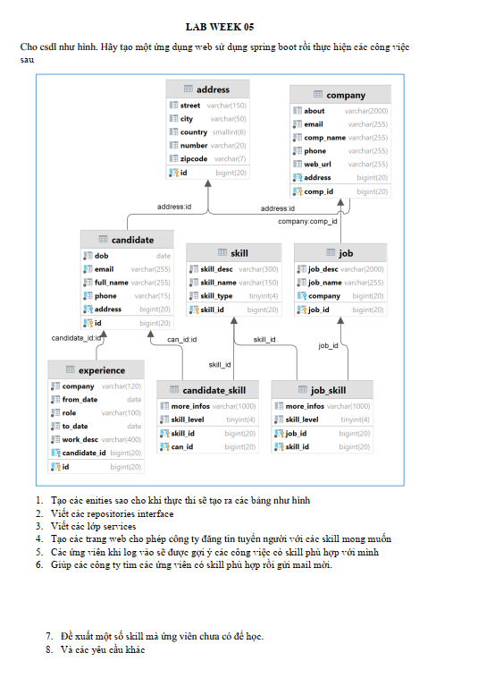
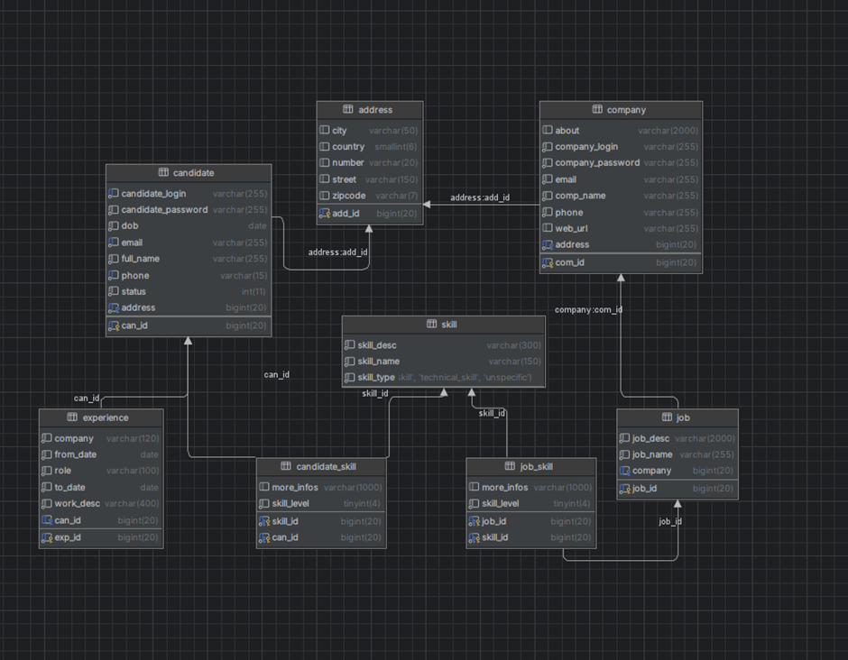
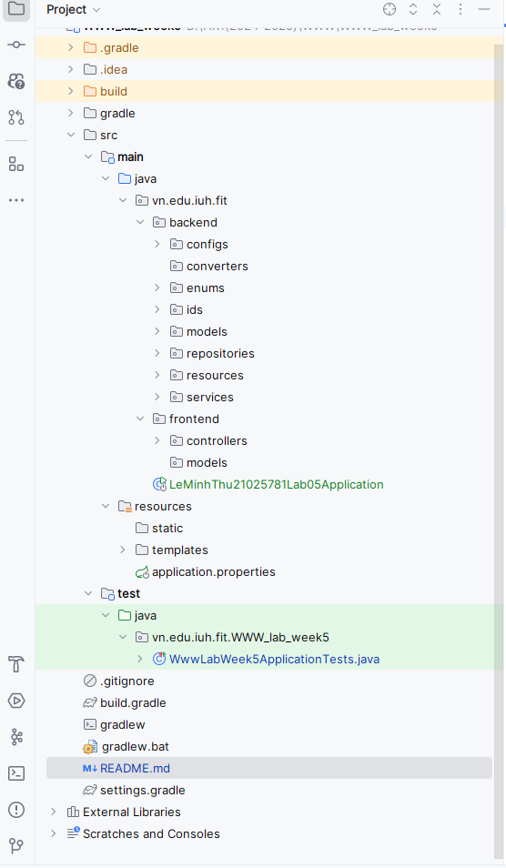
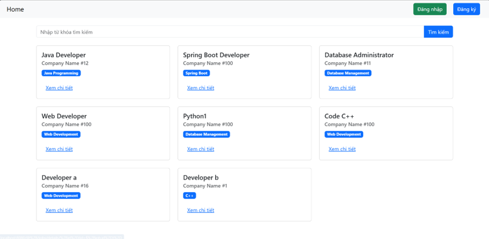
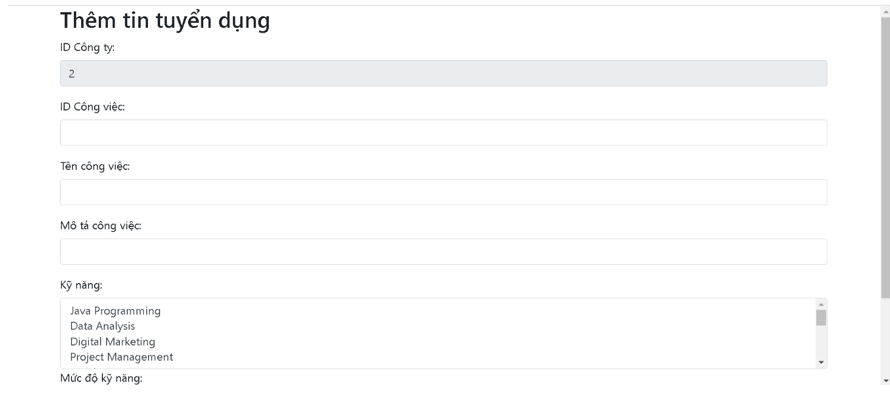
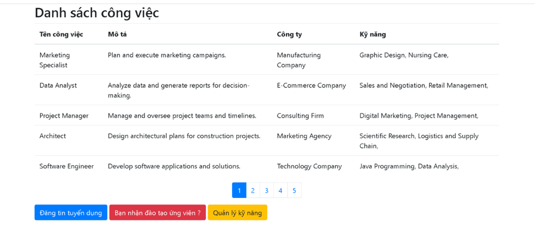
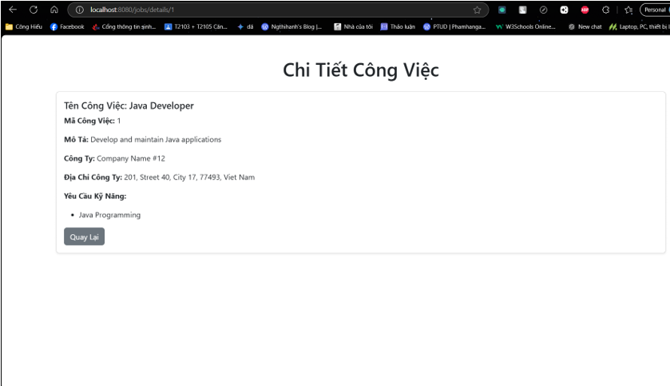
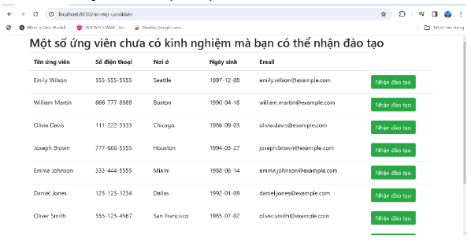
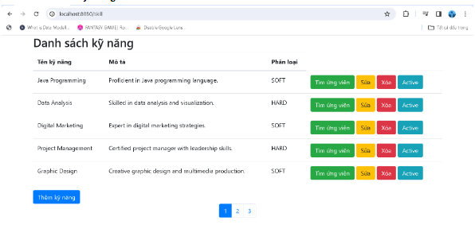

# www_lab_week5
## Sinh viên thực hiện:

Họ tên: [Lê Minh Thư]

MSSV: [21025781]

## Đề bài thực hành tuần 5 môn Lập trình WWW:


## Mô tả

Dự án Jakarta EE này được phát triển để quản lý  trang web cho phép công ty đăng tin tuyển người với các skill mong muốn. Các ứng viên khi log vào sẽ được gợi ý các công việc có skill phù hợp với mình và đề xuất các skill nhân viên có thể học. Giúp các công ty tìm các ứng viên có skill phù hợp và các yêu cầu khác.

## Yêu cầu

Đảm bảo bạn đã cài đặt đầy đủ các thành phần sau:
- Java Development Kit (JDK)
- Maven
- MariaDB

## Công nghệ sử dụng

- Spring Boot: Framework để xây dựng ứng dụng doanh nghiệp dựa trên Java.
- MariaDB: Hệ thống quản lý cơ sở dữ liệu quan hệ.

## Cách cài đặt

1. **Clone dự án từ GitHub hoặc GitLab:**

```
git clone [https://github.com/LMThu2811/www_lab_week5.git](https://github.com/LMThu2811/www_lab_week5.git)
```

2. **Mở dự án bằng một trình biên soạn mã Java:** IntelliJ IDEA.

3. **Cấu hình trong file application.properties:**
 ```
  spring.datasource.driver-class-name=org.mariadb.jdbc.Driver
  spring.datasource.url=jdbc:mariadb://localhost:3306/lab5
  spring.datasource.username=root
  spring.datasource.password=sapass
  spring.jpa.hibernate.ddl-auto=update
  spring.jpa.show-sql=true
  server.port=8080
  
  spring.jpa.hibernate.naming.implicit-strategy=org.hibernate.boot.model.naming.ImplicitNamingStrategyLegacyJpaImpl
  spring.jpa.hibernate.naming.physical-strategy=org.hibernate.boot.model.naming.PhysicalNamingStrategyStandardImpl
  ```
4. **Kết nối database Mariadb:**
   ### Database script:
   ```
     -- Dumping database structure for works
      CREATE DATABASE IF NOT EXISTS `works` /*!40100 DEFAULT CHARACTER SET latin1
      COLLATE latin1_swedish_ci */;
      USE `works`;
      -- Dumping structure for table works.address
      CREATE TABLE IF NOT EXISTS `address` (
      `id` bigint(20) NOT NULL AUTO_INCREMENT,
      `street` varchar(150) DEFAULT NULL,
      `city` varchar(50) DEFAULT NULL,
      `country` smallint(6) DEFAULT NULL CHECK (`country` between 0 and 201),
      `number` varchar(20) DEFAULT NULL,
      `zipcode` varchar(7) DEFAULT NULL,
      PRIMARY KEY (`id`)
      ) ENGINE=InnoDB DEFAULT CHARSET=latin1 COLLATE=latin1_swedish_ci;
      -- Data exporting was unselected.
      -- Dumping structure for table works.candidate
      CREATE TABLE IF NOT EXISTS `candidate` (
      `id` bigint(20) NOT NULL AUTO_INCREMENT,
      `dob` date NOT NULL,
      `email` varchar(255) NOT NULL,
      `full_name` varchar(255) NOT NULL,
      `phone` varchar(15) NOT NULL,
      `address` bigint(20) NOT NULL,
      PRIMARY KEY (`id`),
      UNIQUE KEY `UK_qfut8ruekode092nlkipgl09g` (`email`),
      UNIQUE KEY `UK_9i5yt1gvm0chg5e10qkns7tll` (`phone`),
      UNIQUE KEY `UK_m8qhlm4wu215gr34dhxp0dour` (`address`),
      CONSTRAINT `FKa8gnyyhbb2qnhp94grci1n0o9` FOREIGN KEY (`address`)
      REFERENCES `address` (`id`)
      ) ENGINE=InnoDB DEFAULT CHARSET=latin1 COLLATE=latin1_swedish_ci;
      -- Data exporting was unselected.
      -- Dumping structure for table works.candidate_skill
      CREATE TABLE IF NOT EXISTS `candidate_skill` (
      `more_infos` varchar(1000) DEFAULT NULL,
      `skill_level` tinyint(4) NOT NULL CHECK (`skill_level` between 0 and 2),
      `skill_id` bigint(20) NOT NULL,
      `can_id` bigint(20) NOT NULL,
      PRIMARY KEY (`can_id`,`skill_id`),
      KEY `FKb7cxhiqhcah7c20a2cdlvr1f8` (`skill_id`),
      CONSTRAINT `FKb0m5tm3fi0upa3b3kjx3vrlxs` FOREIGN KEY (`can_id`) REFERENCES
      `candidate` (`id`),
      CONSTRAINT `FKb7cxhiqhcah7c20a2cdlvr1f8` FOREIGN KEY (`skill_id`)
      REFERENCES `skill` (`skill_id`)
      ) ENGINE=InnoDB DEFAULT CHARSET=latin1 COLLATE=latin1_swedish_ci;-- Data exporting was unselected.
      -- Dumping structure for table works.company
      CREATE TABLE IF NOT EXISTS `company` (
      `comp_id` bigint(20) NOT NULL AUTO_INCREMENT,
      `about` varchar(2000) DEFAULT NULL,
      `email` varchar(255) NOT NULL,
      `comp_name` varchar(255) NOT NULL,
      `phone` varchar(255) NOT NULL,
      `web_url` varchar(255) DEFAULT NULL,
      `address` bigint(20) NOT NULL,
      PRIMARY KEY (`comp_id`),
      UNIQUE KEY `UK_rvp2hunsq4sgmpxe3a7i1ym3m` (`address`),
      CONSTRAINT `FKd5occp4cjwihejbxdbpvkp5tv` FOREIGN KEY (`address`)
      REFERENCES `address` (`id`)
      ) ENGINE=InnoDB DEFAULT CHARSET=latin1 COLLATE=latin1_swedish_ci;
      -- Data exporting was unselected.
      -- Dumping structure for table works.job
      CREATE TABLE IF NOT EXISTS `job` (
      `job_id` bigint(20) NOT NULL AUTO_INCREMENT,
      `job_desc` varchar(2000) NOT NULL,
      `job_name` varchar(255) NOT NULL,
      `company` bigint(20) DEFAULT NULL,
      PRIMARY KEY (`job_id`),
      KEY `FKbaqlvluu78phmo9ld89um7wnm` (`company`),
      CONSTRAINT `FKbaqlvluu78phmo9ld89um7wnm` FOREIGN KEY (`company`)
      REFERENCES `company` (`comp_id`)
      ) ENGINE=InnoDB DEFAULT CHARSET=latin1 COLLATE=latin1_swedish_ci;
      -- Data exporting was unselected.
      -- Dumping structure for table works.job_skill
      CREATE TABLE IF NOT EXISTS `job_skill` (
      `more_infos` varchar(1000) DEFAULT NULL,
      `skill_level` tinyint(4) NOT NULL CHECK (`skill_level` between 0 and 2),
      `job_id` bigint(20) NOT NULL,
      `skill_id` bigint(20) NOT NULL,
      PRIMARY KEY (`job_id`,`skill_id`),
      KEY `FKj33qbbf3vk1lvhqpcosnh54u1` (`skill_id`),
      CONSTRAINT `FK9ix4wg520ii2gu2felxdhdup6` FOREIGN KEY (`job_id`) REFERENCES
      `job` (`job_id`),
      CONSTRAINT `FKj33qbbf3vk1lvhqpcosnh54u1` FOREIGN KEY (`skill_id`)
      REFERENCES `skill` (`skill_id`)
      ) ENGINE=InnoDB DEFAULT CHARSET=latin1 COLLATE=latin1_swedish_ci;
      -- Data exporting was unselected.
      -- Dumping structure for table works.skill
      CREATE TABLE IF NOT EXISTS `skill` (
      `skill_id` bigint(20) NOT NULL AUTO_INCREMENT,
      `skill_description` varchar(255) DEFAULT NULL,
      `skill_name` varchar(255) DEFAULT NULL,
      `type` tinyint(4) DEFAULT NULL CHECK (`type` between 0 and 2),
      PRIMARY KEY (`skill_id`)) ENGINE=InnoDB DEFAULT CHARSET=latin1 COLLATE=latin1_swedish_ci;
   ```


6. **Cấu trúc project:**
  

7. **Chạy ứng dụng:** 
   - Chạy ứng dụng bằng cách chạy lệnh sau trong terminal của IntelliJ IDEA:
   ```
   mvn spring-boot:run
   ```
   - Truy cập ứng dụng qua địa chỉ: [http://localhost:8080](http://localhost:8080)
**Home**

**Đăng nhập với tư cách nhà tuyển dụng**

**Thêm công việc**

**Danh sách công việc**

**Đăng nhập với tư cách ứng viên**

**Các công việc dành cho bạn**

**Chi tiết công việc**

**Danh sách các ứng viên có thể nhận đào tạo**

**Danh sách các kỹ năng**



## Tài liệu liên quan

- [Java EE Documentation](https://javaee.github.io/javaee-spec/)
- [Java Database Connectivity (JDBC) Documentation](https://docs.oracle.com/en/java/javase/16/docs/api/java.sql/java/sql/package-summary.html)
- [Apache Tomcat Documentation](https://tomcat.apache.org/tomcat-9.0-doc/index.html)
- [Git Version Control](https://git-scm.com/book/en/v2)


## Đóng góp

Nếu bạn muốn đóng góp vào dự án hoặc báo cáo lỗi, vui lòng tạo issue hoặc gửi pull request vào repository GitHub của dự án.

- GitHub Repository: [WWW_Lab05](https://github.com/LMThu28/WWW_Lab05)
- Tạo Issue:[Issues](https://github.com/LMThu28/WWW_Lab05/issues/new)
- Gửi Pull request: [Pull requests](https://github.com/LMThu28/WWW_Lab05/pulls)

Chúng tôi rất hoan nghênh mọi đóng góp từ cộng đồng!

---
